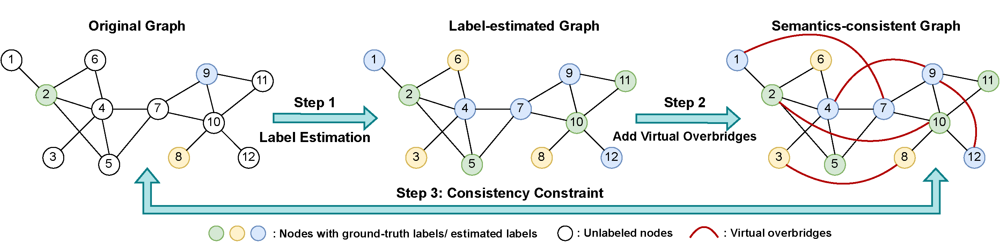

# Violin: Virtual Overbridge Linking

<p align="center"></p>

This is the code repo for the **IJCAI 2023** paper "Violin: Virtual Overbridge Linking for Enhancing Semi-supervised Learning on Graphs with Limited Labels".

Violin is a follow-up work of [CoCoS](https://github.com/xslangley/cocos), both of which are designed to enhance the performance of GNNs in semi-supervised node classification tasks when labeled nodes are limited.

(Still under construction...)


## requirements
- Numpy >= 1.23.1
- PyTorch >= 1.9.0
- PyTorch Geometric == 2.0.4
- scikit-learn >= 1.1.2
- ogb == 1.2.1


> Note: the code may not be compatible with the latest PyTorch Geometric and ogb libraries.
Please modify the code accordingly if you encounter any errors (especially the part of loading dataset).


## Instruction
Two steps to quickly reproduce the results:
1. train the vanilla GCN. Type the following commands:
   - Cora: ```python main.py --model GCN --dataset Cora```
   - Citeseer: ```python main.py --model GCN --dataset Citeseer```
   - Pubmed: ```python main.py --model GCN --dataset Pubmed``
2. enhance the trained GCN model using Violin. Type the following command:
   - Cora: ```python main.py --model ViolinGCN --dataset Cora --alpha 0.8 --delta 0.9```
   - Citeseer: ```python main.py --model ViolinGCN --dataset Citeseer --alpha 0.2 --delta 0.8```
   - Pubmed: ```python main.py --model ViolinGCN --dataset Pubmed --alpha 0.4 --delta 0.9 --cls_mode both --n_vl 2```

If you would like to speed up the training with a GPU, you can specify the ID of your GPU card by adding `--gpu [gpu_id]` to the command line, e.g.,:
1. train the vanilla GCN, with GPU#0. Type the following commands:
   - Cora: ```python main.py --model GCN --dataset Cora --gpu 0```
2. enhance the trained GCN model using Violin, with GPU#0. Type the following command:
   - Cora:```python main.py --model ViolinGCN --dataset Cora --alpha 0.8 --delta 0.9 --gpu 0```

You can modify the training settings by using different hyper-parameters.
Settings corresponding to the reported results are detailed in Table 6 of Appendix D.3.

The complete version of Violin for all experiments will be open-sourced if this paper gets published.